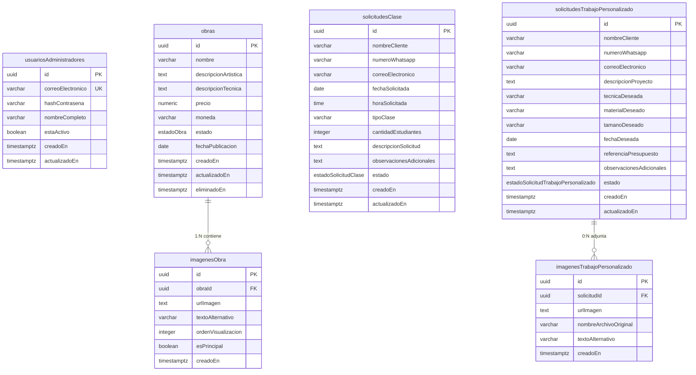

# Diseño de base de datos - Academia Atelier

## 1. Objetivo

Este documento define la estructura de la base de datos para la plataforma web de Academia Atelier. El modelo cubre:

- El catálogo público de obras de arte.
- Las imágenes asociadas a cada obra.
- Las solicitudes de clases.
- Las solicitudes de trabajos personalizados.
- El acceso de usuarios administrativos.

La base de datos debe conservar la información entre sesiones y mantener separadas las operaciones públicas de las administrativas.

## 2. Decisiones de diseño

- Se propone una base de datos relacional, compatible con PostgreSQL.
- Los visitantes no necesitan crear una cuenta.
- Las solicitudes se almacenan antes de redirigir al usuario a WhatsApp.
- El carrito no se persiste en la base de datos en la primera versión: se mantiene en el navegador y únicamente sirve para preparar una consulta por WhatsApp.
- No se registran pagos, reservas, envíos ni ventas dentro de la plataforma.
- Las obras no se eliminan físicamente como operación normal. Se recomienda cambiar su disponibilidad a `NO_DISPONIBLE` para conservar su historial artístico.
- Las credenciales administrativas se almacenan como hashes seguros, nunca como contraseñas en texto plano.
- Las imágenes se almacenan en un servicio de archivos u objeto externo; la base de datos conserva su URL o ruta y sus metadatos.

## 3. Entidades principales

## 4. Tablas y campos

### 4.1 `obras`

Representa cada obra que puede aparecer en el catálogo o en la galería.

| Campo | Tipo | Obligatorio | Descripción |
|---|---|---:|---|
| `id` | UUID | Sí | Identificador único de la obra. |
| `nombre` | VARCHAR(200) | Sí | Nombre de la obra. |
| `descripcionArtistica` | TEXT | Sí | Descripción artística para el público. |
| `descripcionTecnica` | TEXT | Sí | Técnica, materiales, dimensiones u otros datos técnicos. |
| `precio` | NUMERIC(12,2) | Sí | Precio de referencia de la obra. Debe ser mayor o igual que cero. |
| `moneda` | CHAR(3) | Sí | Moneda ISO 4217, por ejemplo `COP`. |
| `estado` | ENUM | Sí | `DISPONIBLE` o `NO_DISPONIBLE`. |
| `fechaPublicacion` | DATE | Sí | Fecha en la que se publica la obra. |
| `creadoEn` | TIMESTAMPTZ | Sí | Fecha de creación del registro. |
| `actualizadoEn` | TIMESTAMPTZ | Sí | Fecha de la última modificación. |
| `eliminadoEn` | TIMESTAMPTZ | No | Marca de eliminación lógica, si se necesita ocultarla permanentemente. |

**Reglas:**

- Una obra solo puede publicarse si tiene nombre, precio, descripción artística y al menos una imagen.
- Solo una obra con estado `DISPONIBLE` puede incluirse como seleccionable para adquisición.
- `NO_DISPONIBLE` no significa necesariamente que la obra deje de aparecer en la galería histórica.

### 4.2 `imagenesObra`

Contiene las fotografías pertenecientes a una obra.

| Campo | Tipo | Obligatorio | Descripción |
|---|---|---:|---|
| `id` | UUID | Sí | Identificador único de la imagen. |
| `obraId` | UUID | Sí | Obra a la que pertenece. |
| `urlImagen` | TEXT | Sí | URL o ruta del archivo almacenado. |
| `textoAlternativo` | VARCHAR(300) | Sí | Texto alternativo descriptivo para accesibilidad y SEO. |
| `ordenVisualizacion` | INTEGER | Sí | Orden de aparición en el carrusel o galería. |
| `esPrincipal` | BOOLEAN | Sí | Indica la imagen principal de la obra. |
| `creadoEn` | TIMESTAMPTZ | Sí | Fecha de creación del registro. |

**Reglas:**

- Cada imagen pertenece a una única obra.
- Una obra debe tener al menos una imagen antes de publicarse.
- Una obra debe tener como máximo una imagen principal.
- El borrado de una obra debe borrar o desvincular sus imágenes para evitar registros huérfanos. Se recomienda `ON DELETE CASCADE` si se realiza una eliminación física.

### 4.3 `solicitudesClase`

Registra cada formulario enviado para solicitar una clase. El registro representa una solicitud, no una reserva confirmada.

| Campo | Tipo | Obligatorio | Descripción |
|---|---|---:|---|
| `id` | UUID | Sí | Identificador de la solicitud. |
| `nombreCliente` | VARCHAR(150) | Sí | Nombre del solicitante. |
| `numeroWhatsapp` | VARCHAR(30) | Sí | Número utilizado para continuar la comunicación. |
| `correoElectronico` | VARCHAR(254) | No | Correo electrónico del solicitante. |
| `fechaSolicitada` | DATE | Sí | Fecha deseada para la clase. |
| `horaSolicitada` | TIME | Sí | Hora deseada para la clase. |
| `tipoClase` | VARCHAR(120) | Sí | Tipo de clase solicitada. |
| `cantidadEstudiantes` | INTEGER | No | Número de estudiantes, si aplica. Debe ser mayor que cero cuando exista. |
| `descripcionSolicitud` | TEXT | No | Descripción de lo que busca el usuario. |
| `observacionesAdicionales` | TEXT | No | Observaciones adicionales. |
| `estado` | ENUM | Sí | Estado de seguimiento de la solicitud. Inicia en `SOLICITADA`. |
| `creadoEn` | TIMESTAMPTZ | Sí | Fecha de recepción de la solicitud. |
| `actualizadoEn` | TIMESTAMPTZ | Sí | Fecha de la última actualización. |

**Estados recomendados:**

- `SOLICITADA`: estado inicial obligatorio.
- `CONTACTADA`: el artista inició comunicación.
- `CONFIRMADA`: la clase fue acordada externamente.
- `ATENDIDA`: la clase se realizó.
- `CANCELADA`: la solicitud no continuará.

Estos estados no procesan pagos ni reemplazan la confirmación directa por WhatsApp.

### 4.4 `solicitudesTrabajoPersonalizado`

Registra las solicitudes de obras personalizadas o encargos.

| Campo | Tipo | Obligatorio | Descripción |
|---|---|---:|---|
| `id` | UUID | Sí | Identificador de la solicitud. |
| `nombreCliente` | VARCHAR(150) | Sí | Nombre del solicitante. |
| `numeroWhatsapp` | VARCHAR(30) | Sí | Número para la comunicación con el artista. |
| `correoElectronico` | VARCHAR(254) | No | Correo electrónico. |
| `descripcionProyecto` | TEXT | Sí | Descripción de la obra que desea solicitar. |
| `tecnicaDeseada` | VARCHAR(120) | No | Técnica preferida, si la conoce. |
| `materialDeseado` | VARCHAR(120) | No | Material preferido, si aplica. |
| `tamanoDeseado` | VARCHAR(120) | No | Tamaño o dimensiones aproximadas. |
| `fechaDeseada` | DATE | No | Fecha ideal de entrega, sin representar compromiso. |
| `referenciaPresupuesto` | TEXT | No | Presupuesto o rango de referencia informado por el cliente. |
| `observacionesAdicionales` | TEXT | No | Observaciones adicionales. |
| `estado` | ENUM | Sí | Estado de seguimiento de la solicitud. Inicia en `RECIBIDA`. |
| `creadoEn` | TIMESTAMPTZ | Sí | Fecha de recepción. |
| `actualizadoEn` | TIMESTAMPTZ | Sí | Fecha de la última actualización. |

**Estados recomendados:**

- `RECIBIDA`: solicitud recién enviada.
- `EN_REVISION`: el artista está evaluando el encargo.
- `CONTACTADA`: se inició comunicación con el cliente.
- `ACEPTADA`: el artista aceptó avanzar con la propuesta.
- `RECHAZADA`: el artista no puede realizar el encargo.
- `CANCELADA`: el cliente o el artista canceló el proceso.
- `FINALIZADA`: el encargo concluyó. Este estado no implica que se haya procesado un pago en la plataforma.

### 4.5 `imagenesTrabajoPersonalizado`

Permite adjuntar imágenes de referencia enviadas por el cliente para explicar un trabajo personalizado.

| Campo | Tipo | Obligatorio | Descripción |
|---|---|---:|---|
| `id` | UUID | Sí | Identificador de la imagen. |
| `solicitudId` | UUID | Sí | Solicitud personalizada a la que pertenece. |
| `urlImagen` | TEXT | Sí | URL o ruta segura del archivo. |
| `nombreArchivoOriginal` | VARCHAR(255) | No | Nombre original para facilitar la identificación. |
| `textoAlternativo` | VARCHAR(300) | No | Descripción accesible de la imagen. |
| `creadoEn` | TIMESTAMPTZ | Sí | Fecha de carga. |

Estas imágenes deben validarse por tipo, tamaño y permisos de acceso, porque pueden contener información privada del cliente.

### 4.6 `usuariosAdministradores`

Representa a los usuarios autorizados para administrar el catálogo.

| Campo | Tipo | Obligatorio | Descripción |
|---|---|---:|---|
| `id` | UUID | Sí | Identificador del administrador. |
| `correoElectronico` | VARCHAR(254) | Sí | Correo único usado para autenticación. |
| `hashContrasena` | TEXT | Sí | Hash generado con un algoritmo adaptativo como Argon2id o bcrypt. |
| `nombreCompleto` | VARCHAR(150) | Sí | Nombre del administrador. |
| `estaActivo` | BOOLEAN | Sí | Permite revocar el acceso sin borrar el historial. |
| `creadoEn` | TIMESTAMPTZ | Sí | Fecha de creación. |
| `actualizadoEn` | TIMESTAMPTZ | Sí | Fecha de actualización. |

El panel administrativo debe validar autenticación y autorización en el servidor. Ocultar la URL del panel no es suficiente como mecanismo de seguridad.

## 5. Relaciones

- `obras` 1:N `imagenesObra`: una obra tiene una o más imágenes para publicarse.
- `solicitudesTrabajoPersonalizado` 1:N `imagenesTrabajoPersonalizado`: una solicitud puede tener cero o más imágenes de referencia.
- `solicitudesClase` no depende de una cuenta de usuario: cada solicitud conserva los datos entregados en el formulario.
- `solicitudesTrabajoPersonalizado` no depende de una cuenta de usuario: cada solicitud conserva los datos entregados en el formulario.
- `usuariosAdministradores` administra el contenido, pero no es necesario almacenar en cada tabla quién realizó cada cambio en la primera versión. Si se requiere auditoría, puede añadirse posteriormente una tabla `registrosAuditoria`.

## 6. Restricciones e índices

### Restricciones obligatorias

- `obras.precio >= 0`.
- `obras.moneda` debe contener un código de tres letras.
- `obras.estado` solo admite `DISPONIBLE` o `NO_DISPONIBLE`.
- `imagenesObra.ordenVisualizacion >= 0`.
- Debe existir como máximo una imagen principal por obra.
- `solicitudesClase.cantidadEstudiantes IS NULL OR cantidadEstudiantes > 0`.
- `solicitudesClase.estado` inicia en `SOLICITADA`.
- `solicitudesTrabajoPersonalizado.estado` inicia en `RECIBIDA`.
- Los correos, cuando existan, deben validarse en la capa de aplicación y almacenarse normalizados.

### Índices recomendados

- `obras(estado, fechaPublicacion)` para el catálogo público.
- `imagenesObra(obraId, ordenVisualizacion)` para cargar el carrusel ordenado.
- `solicitudesClase(estado, fechaSolicitada)` para el panel administrativo.
- `solicitudesTrabajoPersonalizado(estado, creadoEn)` para gestionar los encargos recibidos.
- Índice único sobre `usuariosAdministradores(correoElectronico)`.
- Índice único parcial sobre `imagenesObra(obraId)` donde `esPrincipal = TRUE`.

## 7. Archivos SQL

Cada entidad tiene su propio archivo SQL. Los nombres están escritos en
español y conservan el camelCase mediante comillas dobles, porque PostgreSQL
convierte automáticamente los identificadores sin comillas a minúsculas.

### Orden de ejecución recomendado

1. `obras.sql`: crea la tabla `obras` y el tipo `estadoObra`.
2. `imagenesObra.sql`: crea las imágenes y su relación con `obras`.
3. `solicitudesClase.sql`: crea las solicitudes de clases y su tipo de estado.
4. `solicitudesTrabajoPersonalizado.sql`: crea los encargos y su tipo de estado.
5. `imagenesTrabajoPersonalizado.sql`: crea las imágenes de referencia y su relación con los encargos.
6. `usuariosAdministradores.sql`: crea los usuarios autorizados del panel.

Cada archivo contiene comentarios junto a sus declaraciones para explicar
claves primarias, claves foráneas, valores obligatorios, valores por defecto,
restricciones `CHECK`, índices y reglas de seguridad.

La regla "una obra publicada debe tener al menos una imagen" no puede
implementarse con un `CHECK` simple porque necesita consultar otra tabla. Debe
validarse en la aplicación o mediante un trigger antes de cambiar `obras.estado`
a `DISPONIBLE`.

## 8. Flujo de datos esperado

### Publicación de una obra

1. El administrador crea la obra con estado `NO_DISPONIBLE`.
2. El administrador carga una o más imágenes.
3. El sistema valida los campos obligatorios y la existencia de una imagen.
4. El administrador decide si marca o no la obra como `DISPONIBLE`.
5. El catálogo público consulta únicamente registros no eliminados y según su estado.

### Solicitud de clase

1. El visitante diligencia los campos obligatorios.
2. El servidor valida y normaliza los datos.
3. El servidor crea un registro en `solicitudesClase` con estado `SOLICITADA`.
4. Solo después de guardar correctamente, genera el enlace o mensaje de WhatsApp.
5. La coordinación posterior se realiza fuera de la plataforma.

### Solicitud de trabajo personalizado

1. El visitante diligencia la descripción y sus datos de contacto.
2. El servidor valida los campos y, si existen, las imágenes de referencia.
3. El servidor crea el registro en `solicitudesTrabajoPersonalizado` con estado `RECIBIDA`.
4. Guarda las imágenes en `imagenesTrabajoPersonalizado` cuando corresponda.
5. Genera el contacto por WhatsApp sin crear una cotización ni una transacción automática.

## 9. Fuera del alcance de esta primera versión

No se incluyen tablas para:

- Usuarios públicos o cuentas de clientes.
- Pagos o tarjetas.
- Órdenes de compra.
- Inventario transaccional.
- Envíos.
- Reservas confirmadas automáticamente.
- Facturación.
- Conversaciones completas de WhatsApp.
- Carrito persistente.

Si el alcance comercial crece, el carrito y las conversaciones pueden evolucionar hacia entidades como `orders`, `order_items`, `payments` y `messages`, pero no son necesarias para las reglas de negocio actuales.
